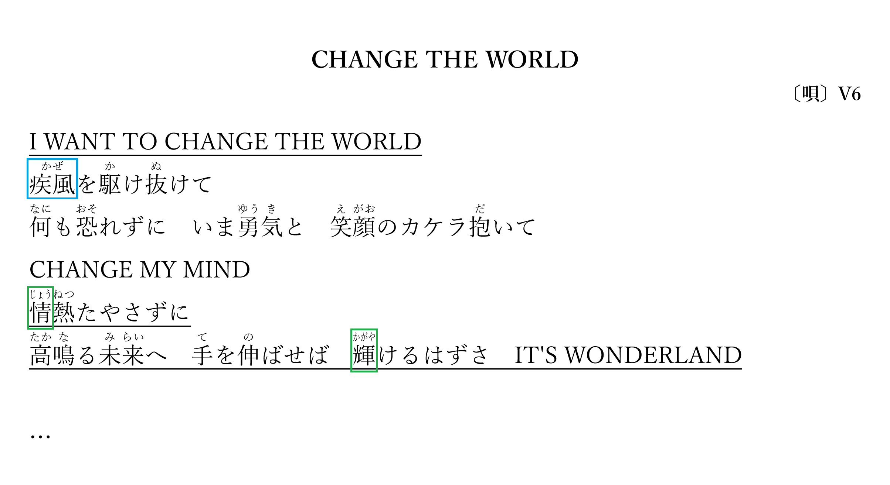

# 注音假名转 HTML

## 功能

* 多个汉字一起对应几个假名的情况下，会将假名集中在一起居中显示（如图中蓝色框所示）
* 单个汉字对应多个假名的情况下，可以对假名进行横向压缩，不影响原有文本的排版（如图中绿色框所示）
* 支持 Firefox、Chrome 等浏览器，对于 IE 浏览器会使用 `<ruby>` 标签进行 fallback



## 使用说明

本程序使用 PHP 编写，既可以在服务器上运行，也可以在本地使用 `php-cli` 运行。
```
http://www.example.com/furigana.php?f=sample.txt
```
```
php furigana.php sample.txt > sample.html
```

## 数据文件格式

文件要求：

* 文件应为 UTF-8 无 BOM 编码
* 换行符应为 Unix 风格（即 `\n` ）
* 文件第一行为网页的标题
* 行末的 `\` 表示将下一行连接到当前行末尾

命令格式：

* `字(假名)`：单个汉字对应几个假名
* `[汉字](假名)`：多个汉字一起对应几个假名
* `{文本}`：将文本直接输出至 HTML
* `<HTML标签>`：将 HTML 标签输出至 HTML

详细细节请参照 `sample.txt` 中的内容。
